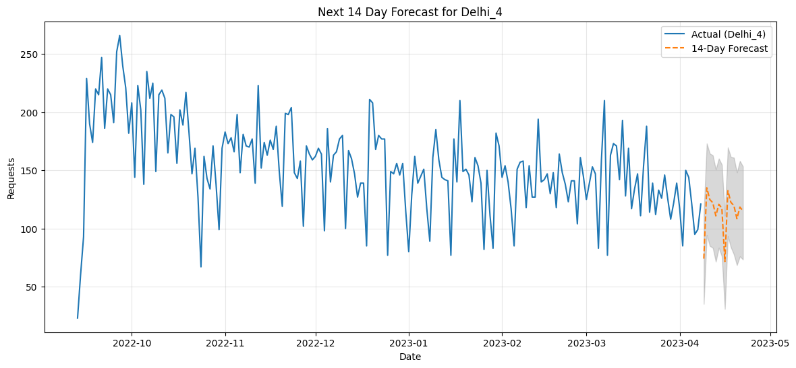
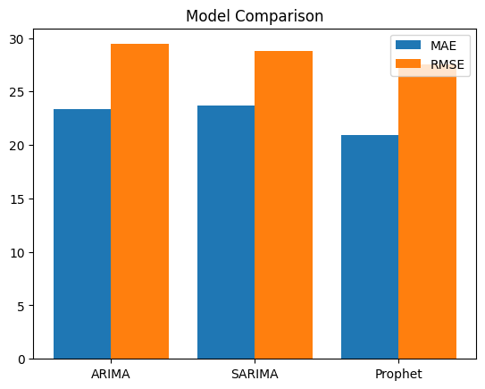
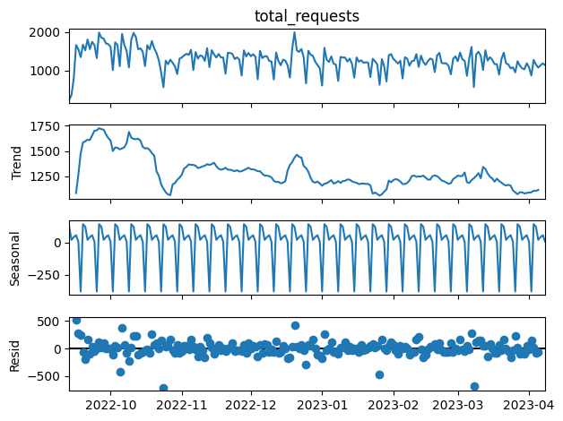

# 📈 Telecom Demand Forecasting

## 🚀 Overview

Accurate demand forecasting is essential for telecom operations to optimize resource allocation and service availability. This project develops time-series models to predict demand patterns and support data-driven planning.

---

## 🧠 Problem

Telecom providers must anticipate demand fluctuations across regions. Poor forecasting can lead to over-provisioning, increased costs, or service degradation.

---

## ⚙️ Approach

* Performed time-series analysis on telecom demand data
* Identified trends and seasonal patterns
* Implemented and compared multiple forecasting models:

  * ARIMA
  * SARIMA
  * Prophet
* Evaluated performance using MAE, RMSE, and SMAPE
* Selected the best-performing model for forecasting

---

## 📈 Results

* Best model: **Prophet**
* MAE: **20.90**
* RMSE: **27.58**
* SMAPE: **16.07%**

Generated **14-day forward forecasts** to support operational decision-making.

---

## 📊 Forecast Visualization





---

## 🔍 Key Insights

* Strong seasonal patterns observed in demand data
* Demand varies significantly across different regions
* Prophet effectively captured both trend and seasonality

👉 These insights can help telecom providers optimize capacity planning and improve service reliability.

---

## 🔄 Forecasting Pipeline

1. Data preprocessing and cleaning
2. Time-series decomposition (trend & seasonality)
3. Model training (ARIMA, SARIMA, Prophet)
4. Model evaluation (MAE, RMSE, SMAPE)
5. Forecast generation

---

## 🚀 Production Perspective

If deployed in a real-world system:

* Automated forecasting pipelines (daily/weekly updates)
* Integration with operational scheduling systems
* Real-time dashboards for monitoring demand trends
* Continuous model retraining for improved accuracy

---

## 🛠 Tech Stack

Python, Pandas, Statsmodels, Prophet, Matplotlib

---

## ▶️ How to Run

```bash
git clone https://github.com/madhavgrover10/demand-forecasting
cd demand-forecasting
pip install -r requirements.txt
```

Run:

```bash
notebooks/time_series_modelling.ipynb
```

---

## 📂 Project Structure

* data/ → time-series dataset
* notebooks/ → analysis & modeling
* images/ → forecast visualizations

---

## 📬 Contact

LinkedIn: https://linkedin.com/in/madhav-grover-a126b1226
Email: [grovermadhav@gmail.com](mailto:grovermadhav@gmail.com)
