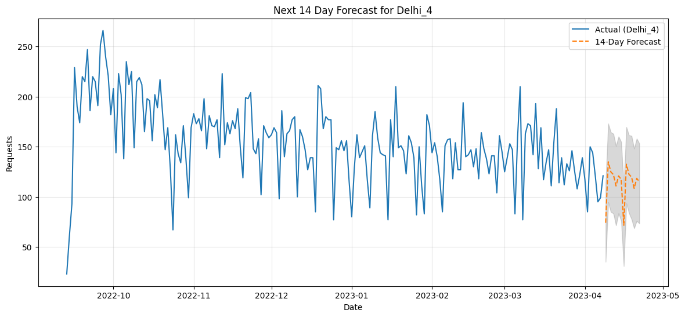
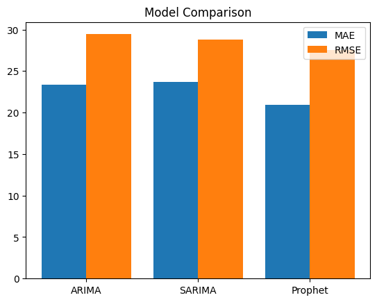
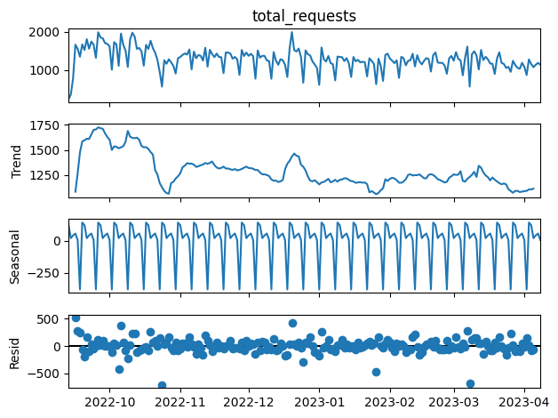

# 📈 Telecom Demand Forecasting

Time-series forecasting project analysing telecom demand across **11 Delhi zones and 208 days**, benchmarking multiple forecasting approaches and generating **14-day forward forecasts** for operational planning.

---

## 🎯 Problem

Telecom providers need to anticipate changes in demand across different regions to support capacity planning and resource allocation.

The goal of this project was to identify demand patterns, compare forecasting approaches, and generate short-term forecasts that could support operational decision-making.

---

## 🔍 Approach

The project followed a structured time-series forecasting workflow:

### 1. Data Preparation

- Analysed **208 days of telecom demand data**
- Examined demand across **11 Delhi zones**
- Prepared the time-series data for forecasting
- Investigated trends and seasonal behaviour

### 2. Time-Series Analysis

- Analysed demand patterns over time
- Investigated trend and seasonality
- Performed time-series decomposition
- Compared demand behaviour across regions

### 3. Model Benchmarking

Benchmarked **7 forecasting approaches**, including:

- ARIMA
- SARIMA
- Exponential Smoothing
- Prophet
- Additional baseline and forecasting approaches

Models were evaluated using chronological validation to avoid data leakage from future observations.

### 4. Model Evaluation

Models were compared using:

- MAE
- RMSE
- SMAPE

### 5. Forecasting

The best-performing approach was selected and used to generate **14-day forward forecasts**.

---

## 📈 Results

### Best Model: Prophet

| Metric | Result |
|---|---:|
| MAE | **20.90** |
| RMSE | **27.58** |
| SMAPE | **16.07%** |
| Forecast Horizon | **14 days** |

Prophet provided the strongest performance among the evaluated approaches based on the selected evaluation metrics.

---

## 📊 Forecast Visualisation

### 14-Day Forecast



### Model Comparison



### Seasonal Decomposition



---

## 🔍 Key Insights

- Demand exhibited clear **trend and seasonal patterns**.
- Demand varied significantly across the **11 geographic zones**.
- Forecasting performance differed across the evaluated approaches.
- **Prophet** effectively captured the observed trend and seasonal behaviour and produced the strongest forecasting performance in this analysis.

These findings demonstrate how time-series modelling can support short-term demand planning and capacity analysis.

---

## 🔄 Forecasting Pipeline

```text
Raw Demand Data
       ↓
Data Preparation
       ↓
Exploratory Time-Series Analysis
       ↓
Trend & Seasonality Analysis
       ↓
Chronological Validation
       ↓
7 Forecasting Approaches
       ↓
Model Evaluation
       ↓
Best Model Selection
       ↓
14-Day Forecast
